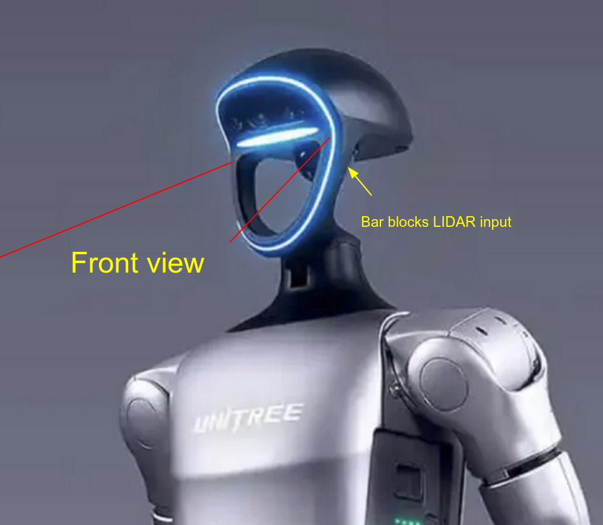
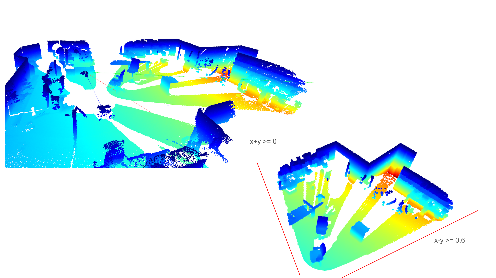
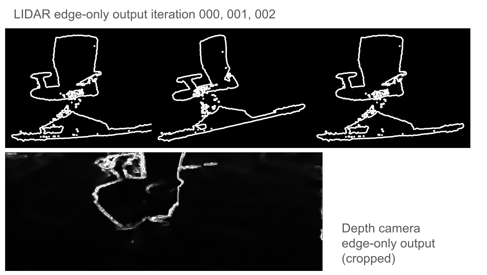
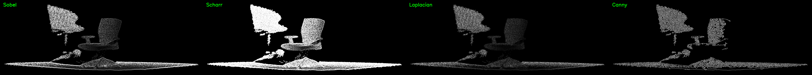
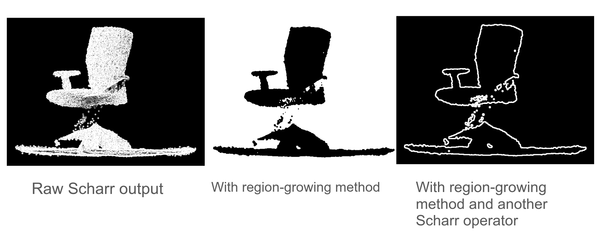

## Overview

This folder contains tools and notes for LiDAR–camera alignment and visualization.

## Demo of merged topic


## Contents

- `images/`: demo media for this repo (GIFs, screenshots)
- `auto_align/`: automatic alignment codes
- `manual_align2display/`: manual alignment, save aligned config to `.json` file, and publish the merged topic in ROS2

## Running the code

### Manual alignment


The manual calibration code could be directly ran through:
```
python depth_edge_generate.py
```
Then:
```
python gui_render_full.py
```
Pressing key `S` in the GUI would save a `.json` configuration file at subdirectory `\alignment-states`. And by stating the `--state-path` in args we could load the configuration from previous aligned config files.

Example: 
```
python gui_render_full.py   --state-path alignment_states/full_lidar_state_YYYYMMDD_HHMMSS.json 
```

To merge the LIDAR and depth topics into one aligned topic we need to run:

```
python3 live_merge_node_try_v2.py --ros-args   -p depth_topic:=/camera/depth/image_rect_raw   -p lidar_topic:=/livox/lidar   -p state_path:=alignment_states/full_lidar_state_YYYYMMDD_HHMMSS.json   -p output_topic:=/merged/depth_image
```

The output result is showned in the `.gif` at the top.

### Auto alignment (partially works)

To run the auto alignment progress, directly run: 
```
python align_entropy.py
```
This will automatically calls on the functions inside file `depth_edge_generate.py` and `function_lidar_gen_chair.py`. The same applies for the fusion code.

`depth_edge_generate.py` acquires from topic `/camera/depth/image_rect_raw`, which is the standard topic for depth camera for realsense D400-series RGBD cameras, and automatically performes optimized edge detection algorithm (scharr + gaussian blur + denoise) to generate a sharp edge-only image based on the depth image. More details in the **Design comments** section.

`function_lidar_gen_chair.py` acquires from topic `/livox/lidar`, takes in a set of (pitch, yaw, roll) parameters, and outputs a direct (mirrored) camera view based on coordinates (0,0,0). Constraints such as POV is applied here. As on Unitree G1 humanoid, the facial bar of the humanoid segments the LIDAR image into three sections. For alignment purposes, only the LIDAR points with distance ($\leq$ 3m) are used to compared with the depth cam, as it well captures the chair in the test sample.




Through an iterative process using entropy as the loss function, LIDAR edge-only images are compared with the processed edge-only image from the depth camera. However, small rotations can sometimes occur during alignment, which significantly impacts the entropy loss evaluation—especially given the limited pixel count at the initial stage. As a result, the overall accuracy of the auto-alignment remains an area for further improvement.



## Design comments

### Why edge detection?
I saw a couple of literatures using edge detection algorithms to align RGB camera with LIDAR image and also using an iterative ML approach, so I thought it might work as well for this task.

### Speed criteria for camera fusing
The current ROS2 topic output method seems to be limited in FPS, as CV2 is used to perform all the translation, rotation (for LIDAR), and copy and pasting (for depth). The computation time might limit the speed to ~10FPS.
For demo purposes, I have set the code to acquire 0.5s for LIDAR points and hold for 2 sec to show the acquired point cloud. I could try to push the limit to achieve real time fusion. This is certainly open for some CUDA programming, matrix multiplication is highly parallizable.

### Selection on edge detection algorithms

I tested various famous edge detection algorithms, and Scharr performs the best out of the four: 



Since LIDAR often have missing point inside the object, a flat surface might get falsely recognized as a surface full of edge. So I implemented a grow method that blurs the image, and recognizes strong edge from weak edge. For any $>$ 10 seconds LIDAR acquisition, the region-growing method should be able to handle all missing points within a surface. This method is incorporated in all the code aforementioned. 

